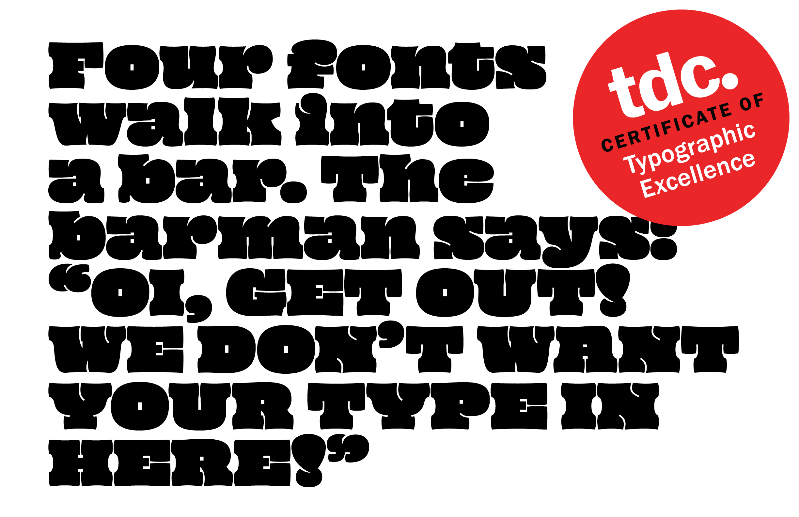
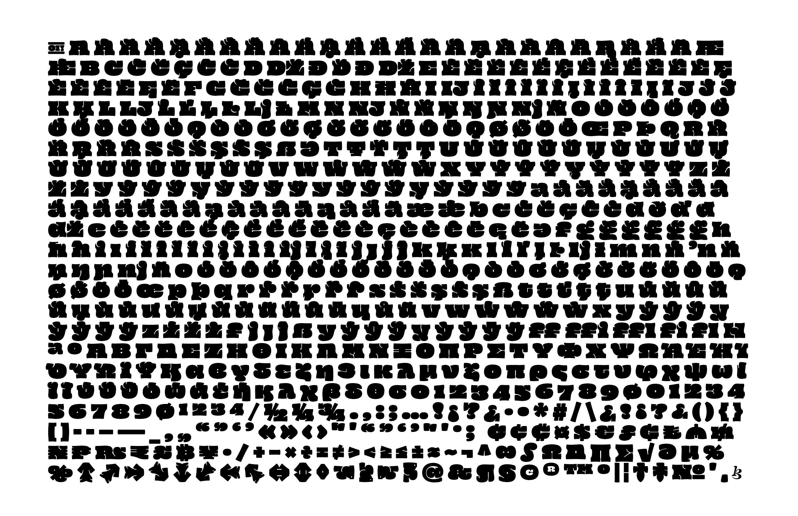
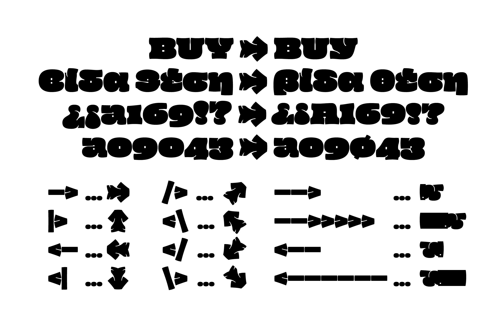

# Oi!
Oi is a display typeface designed by Kostas Bartsokas.
 

## Basic Information
Oi is an ultra-fat display typeface that has its roots in grotesque slab serifs, most specifically the style that sprung with the release of Caslon’s Ionic in 1844 and Clarendon by Fann Street Foundry in 1845.

Oi is a free spirited twisted interpretation of the clarendonesques. With an unapologetic tendecy for public shouting, it is a whimsical loudmouth attention seeker!

Oi is an interjection used in various languages. Its meaning varies, depending on the tone and abruptness of its use, from a simple “hi” or a call of attention to as far as a challenge to a fight.

Oi supports the Google Arabic Core, Arabic Plus, Latin Plus, Latin Pro, Latin PriAfrican, Latin African, Cyrillic Plus, Cyrillic Plus .locl, Cyrillic Pro, Greek Core, and Tamil character sets. The typeface has received the TDC Award of Excellence in Type Design in 2018. 

Check out the [mini-site](https://kostasbartsokas.com/oi-you-mate/) designed by [Apostolos Christodoulou](https://github.com/a7sc11u) and give it a test. Read more about [the story of Oi!](https://blog.usejournal.com/the-story-of-oi-508d7027e67b)

This typeface project received financial support from Google, and is avaiable on [Google Fonts](https://fonts.google.com/specimen/Oi).

**Character Set**
 

**Some cool opentype features**
 

**Language Support**
<details>
<summary>Expand</summary>
<p>
Arabic: Baharna Arabic, Dari, Dogri (individual language), Egyptian Arabic, Gulf Arabic, Iranian Persian, Iraqi Arabic, Libyan Arabic, Moroccan Arabic, North Mesopotamian Arabic, Qashqa'i, Saidi Arabic, Sanaani Arabic, Standard Arabic, Talysh, Ta’izzi-Adeni Arabic, Tunisian Arabic, Urdu
<p>
Latin: Abidji, Abron, Abua, Acheron, Achinese, Acholi, Achuar-Shiwiar, Adamawa Fulfulde, Adangme, Adele, Afar, Afrikaans, Aghem, Agni, Aguaruna, Ahanta, Ahtna, Aja (Benin), Akebu, Akoose, Alekano, Aleut, Amahuaca, Amarakaeri, Amis, Anaang, Andaandi, Dongolawi, Angas, Anii, Anufo, Anuta, Arabela, Aragonese, Arbëreshë Albanian, Asháninka, Ashéninka Perené, Asturian, Atayal, Avatime, Awa-Cuaiquer, Awing, Ayizo Gbe, Baatonum, Bafia, Bagirmi Fulfulde, Balante-Ganja, Balinese, Balkan Romani, Bambara, Baoulé, Bari, Basa (Cameroon), Basque, Bassari, Batak Dairi, Batak Karo, Batak Mandailing, Batak Simalungun, Batak Toba, Bemba (Zambia), Bena (Tanzania), Biali, Bikol, Bini, Bislama, Bissa, Boko (Benin), Bomu, Bora, Borana-Arsi-Guji Oromo, Borgu Fulfulde, Bosnian, Breton, Buamu, Buginese, Bushi, Candoshi-Shapra, Caquinte, Caribbean Hindustani, Cashibo-Cacataibo, Cashinahua, Catalan, Cebuano, Central Atlas Tamazight, Central Aymara, Central Kurdish, Central Nahuatl, Central-Eastern Niger Fulfulde, Cerma, Chachi, Chamorro, Chavacano, Chayahuita, Chiga, Chiltepec Chinantec, Chokwe, Chuukese, Cimbrian, Cofán, Cook Islands Māori, Cornish, Corsican, Creek, Crimean Tatar, Croatian, Czech, Dagbani, Danish, Dehu, Dimli, Dinka, Duala, Dutch, Dyan, Dyula, Eastern Arrernte, Eastern Maninkakan, Eastern Oromo, Efik, English, Ewe, Ewondo, Fanti, Farefare, Faroese, Fe'Fe', Fijian, Filipino, Finnish, Fon, Foodo, French, Friulian, Ga, Gagauz, Galician, Ganda, Garifuna, Gen, German, Gheg Albanian, Gilbertese, Gonja, Gooniyandi, Gourmanchéma, Guadeloupean Creole French, Guinea Kpelle, Gusii, Gwichʼin, Haitian, Hani, Hassaniyya, Hausa, Hawaiian, Hiligaynon, Hopi, Huastec, Hungarian, Hän, Ibibio, Icelandic, Idoma, Ifè, Igbo, Iloko, Inari Sami, Indonesian, Irish, Istro Romanian, Italian, Ixcatlán Mazatec, Jamaican Creole English, Japanese, Javanese, Jenaama Bozo, Jola-Fonyi, K'iche', Kabiyè, Kabuverdianu, Kabyle, Kaingang, Kako, Kala Lagaw Ya, Kalaallisut, Kalenjin, Kamba (Kenya), Kanuri, Kaonde, Kaqchikel, Kara-Kalpak, Karelian, Kasem, Kashubian, Kekchí, Kenzi, Mattokki, Khasi, Khoekhoe, Kikuyu, Kimbundu, Kinyarwanda, Kirmanjki, Kituba (DRC), Kom (Cameroon), Kongo, Konzo, Koonzime, Koyraboro Senni Songhai, Krio, Kusaal, Kven Finnish, Kwak’wala, Kölsch, Ladin, Ladino, Lakota, Lama, Lamnso', Langi, Latgalian, Lingala, Lithuanian, Lobi, Lombard, Low German, Lower Sorbian, Lozi, Luba-Lulua, Lukpa, Lule Sami, Luo (Kenya and Tanzania), Luxembourgish, Lyele, Láá Láá Bwamu, Maasina Fulfulde, Macedo-Romanian, Madurese, Makonde, Malagasy, Malaysian, Malba Birifor, Maltese, Mam, Mamara Senoufo, Mandinka, Mandjak, Mankanya, Manx, Maore Comorian, Maori, Mapudungun, Marshallese, Masai, Masana, Matsés, Mauritian Creole, Medumba, Megleno Romanian, Mende (Sierra Leone), Meriam Mir, Meru, Metlatónoc Mixtec, Mezquital Otomi, Mi'kmaq, Minangkabau, Mirandese, Miyobe, Mizo, Mohawk, Montagnais, Montenegrin, Mossi, Mundang, Munsee, Murrinh-Patha, Murui Huitoto, Muslim Tat, Mwani, Ménik, Mískito, Naga Pidgin, Nateni, Navajo, Nawdm, Ndonga, Ndrulo, Neapolitan, Ngazidja Comorian, Ngiemboon, Ngomba, Nigerian Fulfulde, Niuean, Nobiin, Nomatsiguenga, Noon, North Azerbaijani, North Marquesan, North Ndebele, Northeastern Dinka, Northern Bobo Madaré, Northern Dagara, Northern Kissi, Northern Kurdish, Northern Qiandong Miao, Northern Sami, Northern Uzbek, Norwegian, Nuer, Nuuchahnulth, Nyamwezi, Nyanja, Nyankole, Nyemba, Nzima, Occitan, Ojitlán Chinantec, Omaha-Ponca, Orma, Oroqen, Otuho, Palauan, Pampanga, Papantla Totonac, Papiamento, Paraguayan Guaraní, Pedi, Phuie, Picard, Pichis Ashéninka, Piemontese, Pijin, Pintupi-Luritja, Pipil, Pite Sami, Pohnpeian, Polish, Pontic Greek, Portuguese, Potawatomi, Prussian, Pulaar, Pular, Purepecha, Páez, Quechua, Romanian, Romansh, Rotokas, Rundi, Saafi-Saafi, Samoan, Sango, Sangu (Tanzania), Saramaccan, Sardinian, Saxwe Gbe, Scots, Scottish Gaelic, Secoya, Sena, Serbian, Serer, Seri, Seselwa Creole French, Sharanahua, Shawnee, Shilluk, Shipibo-Conibo, Shona, Shuar, Sicilian, Silesian, Siona, Sissala, Slovak, Slovenian, Soga, Somali, Soninke, South Azerbaijani, South Marquesan, South Ndebele, Southern Aymara, Southern Bobo Madaré, Southern Dagaare, Southern Nuni, Southern Qiandong Miao, Southern Sami, Southern Samo, Southern Sotho, Spanish, Sranan Tongo, Standard Estonian, Standard Latvian, Standard Malay, Sukuma, Sundanese, Susu, Swahili, Swedish, Swiss German, Syenara Senoufo, Tachelhit, Tagalog, Tahitian, Talysh, Tedim Chin, Tem, Tetum, Tetun Dili, Thompson, Ticuna, Tigon Mbembe, Tikar, Timne, Tiéyaxo Bozo, Tlingit, Toba, Tojolabal, Tok Pisin, Tokelau, Toma, Tonga (Tonga Islands), Tonga (Zambia), Tosk Albanian, Tsafiki, Tsakhur, Tumbuka, Turka, Turkish, Turkmen, Tuvalu, Twi, Tzeltal, Tzotzil, Uab Meto, Umbundu, Ume Sami, Upper Guinea Crioulo, Upper Sorbian, Urarina, Venda, Venetian, Veps, Vietnamese, Vlax Romani, Võro, Waci Gbe, Wallisian, Walloon, Walser, Wamey, Waray (Philippines), Warlpiri, Wasa, Wayuu, Welsh, West Central Oromo, West-Central Limba, Western Abnaki, Western Frisian, Western Niger Fulfulde, Winyé, Wiradjuri, Wolof, Xhosa, Xwela Gbe, Yagua, Yanesha', Yao, Yom, Yoruba, Yucateco, Zapotec, Zarma, Zulu, Zuni, Záparo
<p>
Greek: Monotonic Modern Greek.
<p>
Cyrillic: Abaza, Adyghe, Aghul, Andi, Archi, Avaric, Bashkir, Belarusian, Bezhta, Budukh, Bulgarian, Chamalal, Chechen, Chinese, Buriat, Chuvash, Crimean, Tatar, Dargwa, Dido, Dungan, Eastern, Mari, Erzya, Halh, Mongolian, Ingush, Judeo-Tat, Kabardian, Kalmyk, Karachay-Balkar, Karaim, Karata, Kazakh, Khakas, Khinalugh, Kirghiz, Komi-Permyak, Komi-Zyrian, Krymchak, Kumyk, Lak, Lezghian, Macedonian, Moksha, Mongolian, Buriat, Montenegrin, Muslim, Tat, Nogai, North, Azerbaijani, Northern, Altai, Northern, Kurdish, Northern, Yukaghir, Ossetian, Russian, Russian, Buriat, Rusyn, Rutul, Serbian, Shor, Southern, Altai, Southern, Yukaghir, Tabassaran, Tatar, Tsakhur, Tuvinian, Udi, Udmurt, Ukrainian, Urum, Western, Mari, Yakut
<p>
Tamil
<p>
</details>  

## Building the fonts

### Automated build with gftools builder

#### Step 1: Install Requirements

Set up a virtual environment in the root directory:

```
virtualenv -p python3 venv
```

Activate the virtual environment with:

```
source venv/bin/activate
```

Install requirements with:

```
pip install -U -r requirements.txt
```

#### Step 2: Gftools builder magic

Once you make any change to the repo and push, the Build and Check action takes place. 

Go to the Actions tab and click on the latest Workflow result. 

Scroll down to see a package in the Artifacts section. 

The package contains the otf, ttf, and webfont font files as well as a fontbakery report. 

Download the zip to access the font files.


### Alternative build method

#### Step 1: Install Requirements

Set up a virtual environment in the root directory:

```
virtualenv -p python3 venv
```

Activate the virtual environment with:

```
source venv/bin/activate
```

Install requirements with:

```
pip install -U -r requirements_old.txt
```

#### Step 2: Build the fonts

**Building the fonts**

The script for building the fonts is in the `/sources/` folder.

To build ttf, otf, and woff2 run:

```
cd sources
sh build.sh
```

The files will appear in the corresponding folders in the ../font folder. 

## ChangeLog

This is version 4.000. This version introduces Arabic and SubSaharan African support. 

Version v.3.000 introduced Cyrillic and Tamil support.
Version v.2.000 introduced Vietnamese support and dropped the shadowed style. The default Y was swapped with the previous ss01 version. The font was renamed Oi (without the exclamation mark).

## License

Oi is licensed under the SIL Open Font License v1.1 (<http://scripts.sil.org/OFL>).

